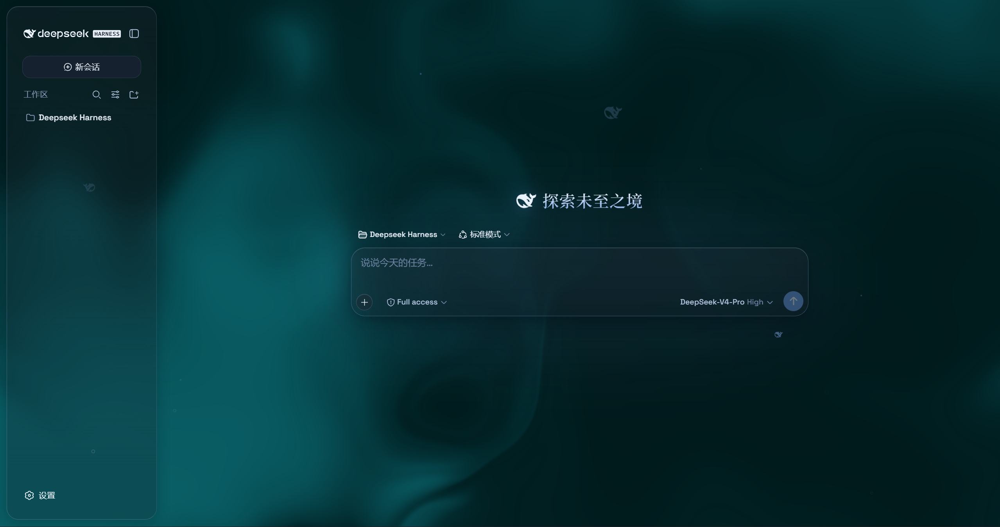
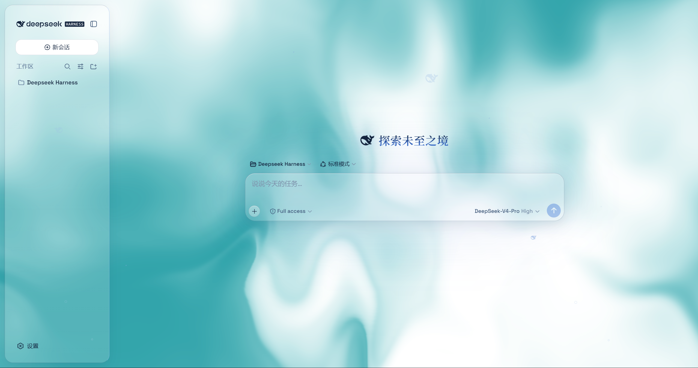
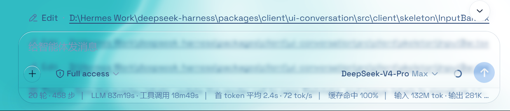
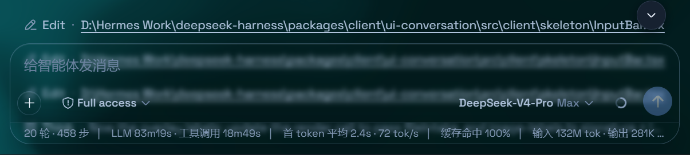

# @deepseek-ai/dsh-client-ui-aqua

[English](README.md) | 中文

Aqua 是一层高自由度的玻璃质感主题，套在 DeepSeek Harness 网页端。顶栏、侧边栏、输入框、统计行、轨迹视图都成了磨砂玻璃片。内置两种模式：漂浮玻璃把布局改成悬浮卡片；兼容模式保持原版排版不动，只把材质换成通用玻璃，其他插件的界面也会自动玻璃化。玻璃模糊度、磨砂度、背景（流体或自定义壁纸，壁纸还能单独调模糊和磨砂）全都能在**通用设置 → 外观**里自由调节。关掉开关就回到原生界面，不改 DSH 任何一行源码。









## 安装


### Windows（一条命令）

```powershell
powershell -ExecutionPolicy Bypass -Command "Invoke-WebRequest 'https://github.com/huangfuren/dsh-client-ui-aqua/raw/main/install.ps1' -OutFile install.ps1; .\install.ps1"
```

默认安装**最新发布版**。不需要装 git，安装器会退回到直接下载 zip。脚本会把插件链接进 profile 的 `node_modules`，并在 `cordis.patch.yml` 里登记 `ui-aqua`（幂等，重复跑不会重复登记）。刷新 Web 界面即可。

指定版本或跟随开发分支：

```powershell
.\install.ps1 -Version 'v1.0.1'   # 指定某个发布版
.\install.ps1 -Version 'main'     # 开发分支
```

### macOS / Linux（手动，三步）

```sh
git clone --depth 1 --branch v1.0.1 https://github.com/huangfuren/dsh-client-ui-aqua.git
ln -s "$PWD/dsh-client-ui-aqua" "$DSH_HOME/profiles/node_modules/@deepseek-ai/dsh-client-ui-aqua"
```

然后往 `$DSH_HOME/profiles/web/cordis.patch.yml` 追加：

```yaml
- insert:
    - id: ui-aqua
      name: '@deepseek-ai/dsh-client-ui-aqua'
```

刷新 Web 界面。Aqua **默认开启**；总开关在 **设置 → 插件 → 玻璃主题**（形状与其他插件卡片一致），其余全部调节在 **设置 → 通用设置 → 外观** 的正下方（无独立标题）。总开关关闭时，外观下方的整块调节自动隐藏。

**v1.0.9**：在 **设置 → 通用设置** 里新增一条独立的「玻璃主题」开关行，位置就在内置的**字号大小**下方（通用分区按数值 order 排序：字号大小是 `11`，所以开关取 `11.4`、玻璃参数旋钮取 `11.5`，不与任何内置行冲突）。该行是「标签 + 胶囊开关 + 一句说明」，不用进插件页就能开关主题。
